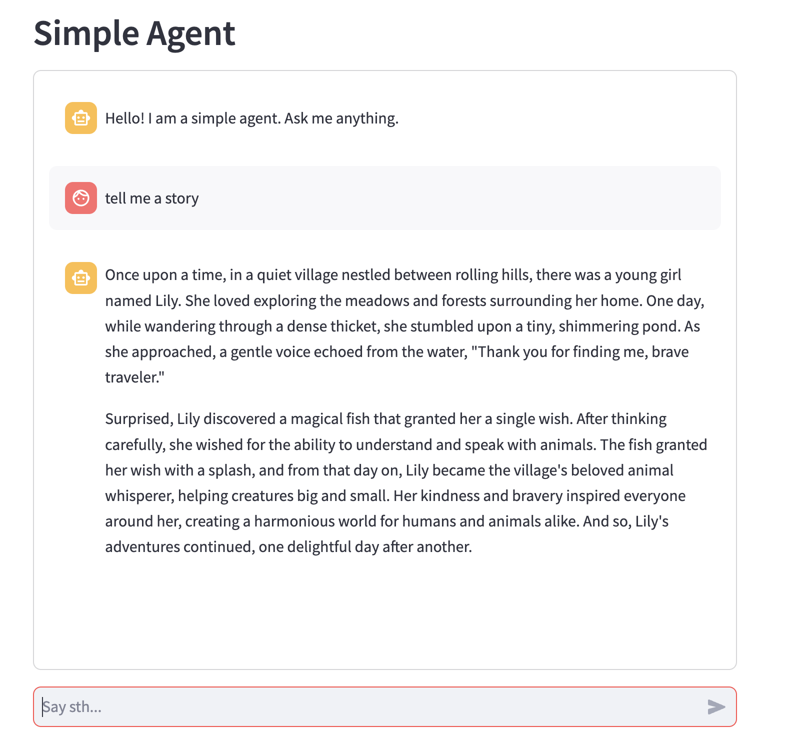

# LAZY-AI-CREATOR
提供一系列脚本，用于快速创建AI项目基底, 主要自用.

*Provides a series of scripts for quickly creating AI project foundations, mainly for personal use.*

## 1. langchain-streamlit-openai-simplechat.sh
- 用途: 用于创建一个简单的streamlit项目, 用于调用openai的chat模型.

- *Purpose: Creates a simple streamlit project for calling OpenAI's chat model.*
```
bash langchain-streamlit-openai-simplechat.sh
pip install -r requirements.txt
bash run.sh
```
当然, 你需要自己修改`.env`文件中的API参数.

*Of course, you need to modify the API parameters in the `.env` file yourself.*

structure:
```
├── agents
│   ├── __init__.py
│   ├── base_agent.py
│   └── simple_openai_agent.py     -- agent class
├── app.py            -- main class
├── local_run.sh
├── prompts
│   └── simple.md     -- default prompt
└── requirements.txt
```

...